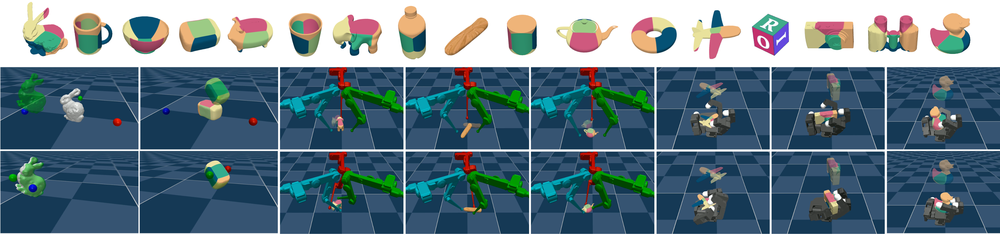
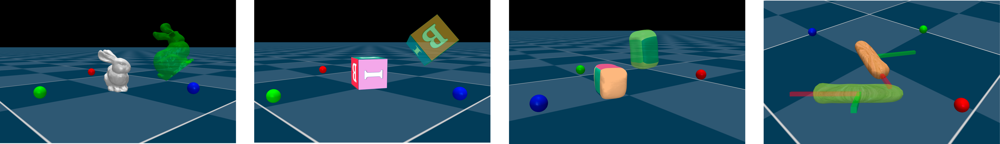
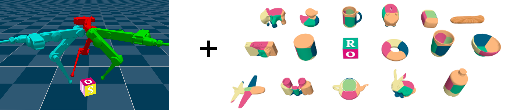
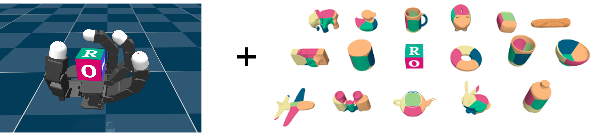

# [Complementarity-Free Dexterous Manipulation](https://arxiv.org/abs/2408.07855)


> ### This code project is an implementation of the paper 
> - **Complementarity-Free Multi-Contact Modeling and Optimization for Dexterous Manipulation**
> - Author: [Wanxin Jin](https://asu-iris.github.io/)
> - Preprint: [https://arxiv.org/abs/2408.07855](https://arxiv.org/abs/2408.07855)
> - Youtube: [https://www.youtube.com/watch?v=NsL4hbSXvFg](https://www.youtube.com/watch?v=NsL4hbSXvFg)


> ### Overview of the paper (TLTR)
> - **Motivation:** to enable model-based planning/control to compete with or even surpass the reinforcement learning in solving challenging dexterous manipulation.
> - **Technical contribution:**  **complementarity-free multi-contact modeling and optimization** method,  effective for contact-interaction prediction and optimization-friendly for contact-rich planning.
> - **State-of-the-art results:** the proposed method consistently achieves state-of-the-art results in various challenging dexterous manipulation tasks, e.g. fingertip 
in-air manipulation, TriFinger in-hand manipulation, and Allegro
hand on-palm reorientation, all with diverse objects:  96.5% success rate  across tasks, high manipulation accuracy: reorientation error of 11° and position error of 7.8 mm, and model predictive control running above 70Hz for all  tasks. 

> ### Video Demo
> [](https://www.youtube.com/watch?v=NsL4hbSXvFg)

---
## Code structure

- **[contact](./contact)**: customized collision detection wrapper (based on [MuJoCo](https://mujoco.readthedocs.io/en/stable/overview.html) APIs).
- **[envs](./envs)**:  all testing environments are here.
- **[examples](./examples)**: 
    *  **[mpc](./examples/mpc)**:  all planning and control examples appeared in the paper (Fingertips 
 manipulation, TriFinger in-hand manipulation, and Allegro
hand on-palm reorientation).
    *  **[sim](./examples/sim)**:  all model prediction examples appeared in the paper (box pushing).
- **[models](./models)** : 
    * `explicit_model.py`: the implementation of the proposed **complementarity-free multi-contact model**.
    * `qp_model.py`:  the implementation of optimization-based multi-contact model.
- **[planning](./planning)**: model predictive control (MPC) class.
    * `mpc_explicit.py`: implementing  complementarity-free contact-implicit MPC planner (proposed in Algorithm 1 in paper).
    * `mpc_implicit.py`: implementing  complementarity-based MPC planner (comparison method).
- **[utils](./utils)**:  utilities functions, such as rotation transformation, metric valuations.

---
## How to run and reproduce the results? (Fun Guaranteed)

The codes have run smoothly with Python 3.11 on the Author's MacBook with Apple M2 Pro chip. <br>
 **Before run examples, you may want to add the project directory to your PYTHONPATH.**
```shell
export PYTHONPATH=/path/to/this/repo:$PYTHONPATH
```

## Run **[Fingertips manipulation examples](./examples/mpc/fingertips)**
[](./examples/mpc/fingertips)


**Instruction**: Use the following command template to run all examples of Fingertip manipulation in the paper. Copy the command template in the 2nd column and replace ```****``` with one in the 3rd column to run.
The command template shown is for MacOS users. For Linux users, start with  ```python``` instead of ```mjpython```

For example, the following command on MacOS
```shell
mjpython examples/mpc/fingertips/cube/test-air.py
```
 runs the example of fintertips 3D in-air manipulation with cube.


| object        	  | Command template (Linux: start with ```python```)                                             	 | replace ```****``` with                                                                                                                                         	|
|------------------|----------------------------------------------------------------------------------------|-------------------------------------------------------------------------------------------------------------------------------------------------------------------	|
| cube           	 | ```mjpython examples/mpc/fingertips/cube/test-****```     	                            | - ```air.py```: in-air manipulation <br> - ```ground-flip.py```: on-ground flipping manipulation <br> - ```ground-rotation.py```: on-ground rotation manipulation 	|
| Stanford bunny 	 | ```mjpython examples/mpc/fingertips/bunny/test-****```     	                           | - ```air.py```: in-air manipulation <br> - ```ground-rotation.py```: on-ground rotation manipulation                                                              	|
| foambrick      	 | ```mjpython examples/mpc/fingertips/foambrick/test-****``` 	                           | - ```air.py```: in-air manipulation <br> - ```ground-flip.py```: on-ground flipping manipulation <br> - ```ground-rotation.py```: on-ground rotation manipulation 	|
| stick          	 | ```mjpython examples/mpc/fingertips/stick/test-****```     	                           | - ```ground-flip.py```: on-ground flipping manipulation                                                                                                           	|


<br>

##  Run **[TriFinger in-hand manipulation examples](./examples/mpc/allegro)**
[](./examples/mpc/trifinger)

**Instruction**: Use the following command template to run all examples of TriFinger in-hand manipulation in the paper. Copy the command template in the 2nd column and replace ```****``` with one in the 3rd column to run.
The command template shown is for MacOS users. For Linux users, start with  ```python``` instead of ```mjpython```

For example: the following command on MacOS
```shell
mjpython examples/mpc/trifinger/bunny/test.py
```
runs the example of TriFinger in-hand manipulation with Standford bunny object.


| Command template for TriFinger in-hand manipulation  examples               	 | replace ```****``` with any of the following object names                                                                                                                                                                                                                                                                                                                                	 |
|-------------------------------------------------------------------------------|--------------------------------------------------------------------------------------------------------------------------------------------------------------------------------------------------------------------------------------------------------------------------------------------------------------------------------------------------------------------------------------------|
| ``` mjpython examples/mpc/trifinger/****/test.py ``` 	                        | - ```airplane``` <br> - ```binoculars``` <br> - ```bowl``` <br> - ```bunny``` <br> - ```camera``` <br> - ```can``` <br> - ```cube``` <br> - ```cup``` <br> - ```elephant``` <br> - ```foambrick``` <br> - ```mug``` <br> - ```piggy_bank``` <br> - ```rubber_duck``` <br> - ```stick``` <br> - ```teapot``` <br> - ```torus``` <br> - ```water_bottle``` <br> 	                            |


<br>

##  Run **[Allegro hand on-palm reorientation examples](./examples/mpc/allegro)**

[](./examples/mpc/allegro)


**Instruction**: Use the following command template to run all examples of Allegro hand on-palm reorientation in the paper. Copy the command template in the 2nd column and replace ```****``` with one in the 3rd column to run.
The command template shown is for MacOS users. For Linux users, start with  ```python``` instead of ```mjpython```

For example: the following command on MacOS
```shell
mjpython examples/mpc/trifinger/bunny/test.py
```
runs the example of Allegro hand on-palm reorientation with Standford bunny object.


| Command template for Allegro hand on-palm reorientation examples               	 | replace ```****``` with any of the following object names                                                                                                                                                                                                                                                                                                                                       	 |
|----------------------------------------------------------------------------------|---------------------------------------------------------------------------------------------------------------------------------------------------------------------------------------------------------------------------------------------------------------------------------------------------------------------------------------------------------------------------------------------------|
| ``` mjpython examples/mpc/allegro/****/test.py ``` 	                             | - ```airplane``` <br> - ```binoculars``` <br> - ```bowl``` <br> - ```bunny``` <br> - ```camera``` <br> - ```can``` <br> - ```cube``` <br> - ```cup``` <br> - ```elephant``` <br> - ```foambrick``` <br> - ```mug``` <br> - ```piggy_bank``` <br> - ```rubber_duck``` <br> - ```stick``` <br> - ```teapot``` <br> - ```torus``` <br> - ```water_bottle``` <br> 	                                   |


---

## Citation
If any part of the project is helpful to your work, please consider citing our work.

```
@article{jin2024complementarity,
  title={Complementarity-Free Multi-Contact Modeling and Optimization for Dexterous Manipulation},
  author={Jin, Wanxin},
  journal={arXiv preprint arXiv:2408.07855},
  year={2024}
}
```

